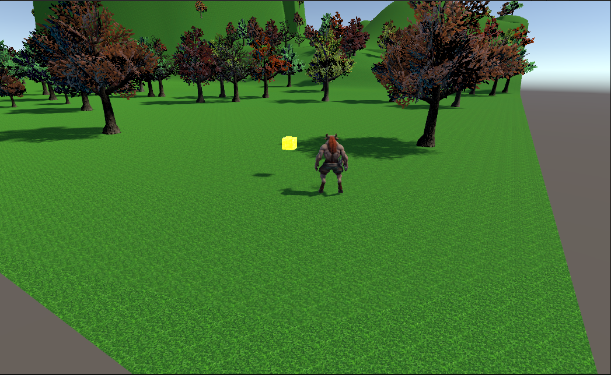

# My First Unity Game

A third-person 3D exploration game built in Unity. Features character movement, physics-based collision, custom terrain, and interactive collectibles.

## 🎮 Features

- **Third-person character controller** with rotation-based movement (A/D to rotate, W/S to move forward/back)
- **Smooth camera follow system** with lerp smoothing
- **Custom sculpted terrain** with hills and valleys
- **Dynamic tree placement** across the landscape
- **Physics-based collision** using Character Controller component
- **Invisible boundary walls** to keep player in playable area
- **Interactive collectibles** - approach and press E to collect spinning objects
- **Optimized rendering** with adjustable view distances

## 🛠️ Technologies Used

- **Unity 6.2** (Built-in Render Pipeline)
- **C#** for gameplay scripting
- **Git/GitHub** for version control
- **Linux** development environment (Ubuntu)

## 📚 What I Learned

This project taught me:
- 3D coordinate systems and transform components
- Component-based architecture in Unity
- Input handling and character controllers
- Physics systems and collision detection
- Camera follow mechanics with smooth lerp
- Terrain sculpting and texturing
- Unity Asset Store workflow
- Trigger colliders for proximity detection
- Object tagging and layer systems
- Destroying GameObjects dynamically
- Git workflow with proper commit practices

## 🎯 Version 1.0 Features

- ✅ Character movement and rotation controls
- ✅ Smooth camera follow system
- ✅ Explorable 3D terrain with trees
- ✅ Invisible boundary walls
- ✅ Interactive collectible objects

## 🚀 Future Improvements

- Add character animations
- Implement UI score counter for collectibles
- Add multiple collectible types
- Create interactive objects (doors, chests)
- Add sound effects and background music
- Expand world with multiple themed areas
- Add particle effects for collecting items

## 📖 Development Timeline

Built over 4 days as a learning project, with approximately 12-15 hours of focused development time.

## 🔗 About

This is my first completed Unity project as part of building a game development portfolio. The goal was to finish a functional game rather than getting stuck in tutorial hell.

**Mission accomplished.**

---

*Built with determination, debugging, and the occasional frustration.*
